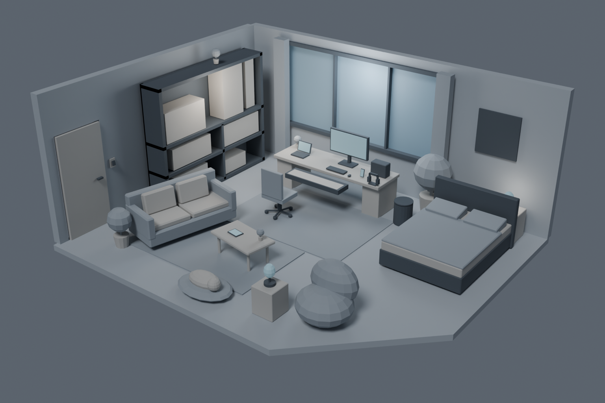

# WebRoom · Sharky's Room

个人交互式 3D 房间项目。目前版本为 **Blender Blockout v0.1**，用于确认房间布局、相机构图和后续网页交互所需的模型结构。

## 当前版本

- 房间与家具的灰盒模型、Hero Camera 和灯光占位。
- 独立交互节点、焦点目标，以及钢琴抽拉、屏幕与垃圾桶盖铰链的轴心设置。
- 可编辑 Blender 源文件、GLB 导出、预览图和验收记录。

当前尚未实现网页界面与浏览器交互，也未进入精细建模和最终材质阶段。

## 文件导航

| 位置 | 内容 |
| --- | --- |
| [Sharkys_Room_Blockout_Pack](Sharkys_Room_Blockout_Pack/README.md) | 参考图、建模规格、交互约定和资源清单 |
| [Blender 源文件](blockout_v01/sharkys_room_blockout_v01.blend) | 可在 Blender 中编辑的首版场景 |
| [GLB 模型](blockout_v01/sharkys_room_blockout_v01.glb) | 后续网页加载使用的模型 |
| [制作与验收报告](blockout_v01/BLOCKOUT_REPORT.md) | 尺寸、节点、导出结果及待确认事项 |
| [制作和检查脚本](blockout_v01/scripts/) | 本版本的构建、验证和报告脚本 |
| [首版交付包](blockout_v01/sharkys_room_blockout_v01_delivery.zip) | 源模型、GLB、预览图和报告的打包文件 |

## 查看方式

下载项目后，使用 Blender 打开 `blockout_v01/sharkys_room_blockout_v01.blend`；仅查看构图可直接打开上方预览图。

模型细节、检查范围及后续需要人工确认的内容见制作与验收报告。
