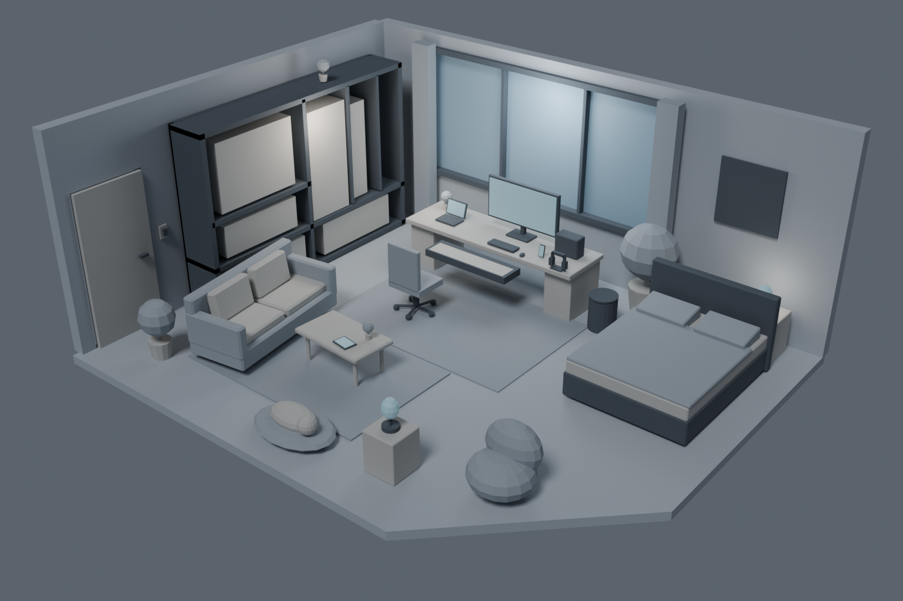
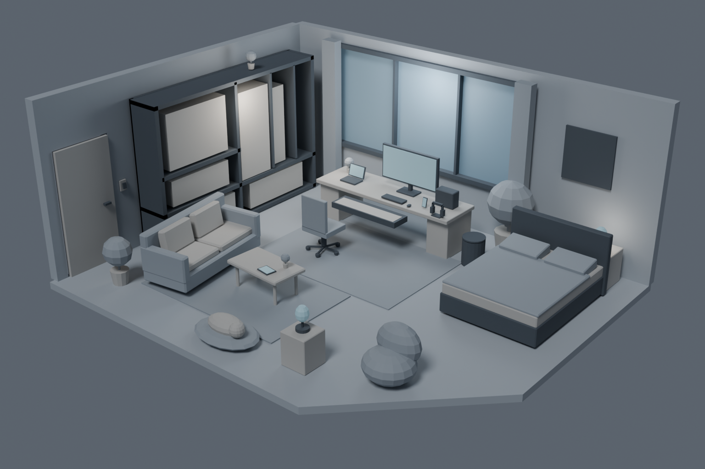

# WebRoom · Sharky's Room

个人交互式 3D 房间项目。目前已完成 **Blender Blockout v0.2 — Composition Lock 候选**，等待确认最终构图和 Hero Camera。尚未进入 v0.3 Interaction Prototype 或精模。

## v0.2 镜头 review

三个候选使用相同的家具、灯光与灰盒材质；原 v0.1 `CAM_Hero` 保留为基准，尚未选定最终镜头。

| A · 45mm | B · 48mm | C · 52mm |
| --- | --- | --- |
|  |  |  |

- [v0.2 Blender 场景](blockout_v02/sharkys_room_blockout_v02.blend)
- [v0.2 GLB 模型](blockout_v02/sharkys_room_blockout_v02.glb)
- [v0.2 修改与验收报告](blockout_v02/BLOCKOUT_REPORT_v02.md)
- [v0.2 六项交付包](blockout_v02/sharkys_room_blockout_v02_delivery.zip)

v0.2 保留已验证的节点、层级、9 个交互目标和机械轴心；84 项检查通过，GLB 约 0.378 MB、6,010 三角面。v0.1 的原始交付保持不变，以下仍可查阅。

## v0.1 基础场景

- 房间与家具的灰盒模型、Hero Camera 和灯光占位。
- 独立交互节点、焦点目标，以及钢琴抽拉、屏幕与垃圾桶盖铰链的轴心设置。
- 可编辑 Blender 源文件、GLB 导出、预览图和验收记录。

当前尚未实现网页界面与浏览器交互，也未进入精细建模和最终材质阶段。

## 文件导航

| 位置 | 内容 |
| --- | --- |
| [Sharkys_Room_Blockout_Pack](Sharkys_Room_Blockout_Pack/README.md) | 参考图、建模规格、交互约定和资源清单 |
| [Blender 源文件](blockout_v01/sharkys_room_blockout_v01.blend) | 可在 Blender 中编辑的首版场景 |
| [GLB 模型](blockout_v01/sharkys_room_blockout_v01.glb) | 后续网页加载使用的模型 |
| [制作与验收报告](blockout_v01/BLOCKOUT_REPORT.md) | 尺寸、节点、导出结果及待确认事项 |
| [制作和检查脚本](blockout_v01/scripts/) | 本版本的构建、验证和报告脚本 |
| [首版交付包](blockout_v01/sharkys_room_blockout_v01_delivery.zip) | 源模型、GLB、预览图和报告的打包文件 |

## 查看方式

下载项目后，使用 Blender 打开 `blockout_v02/sharkys_room_blockout_v02.blend`；仅查看构图可直接打开上方三张预览图。场景默认仍使用原基准 `CAM_Hero`；新候选为 `CAM_Hero_45`、`CAM_Hero_48`、`CAM_Hero_52`。

模型细节、检查范围及后续需要人工确认的内容见制作与验收报告。
