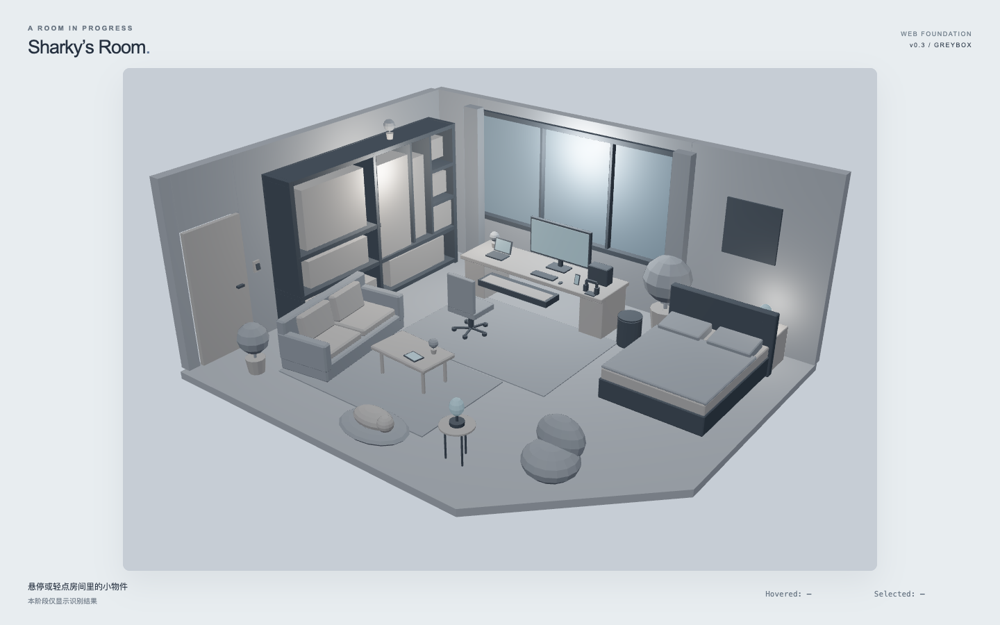
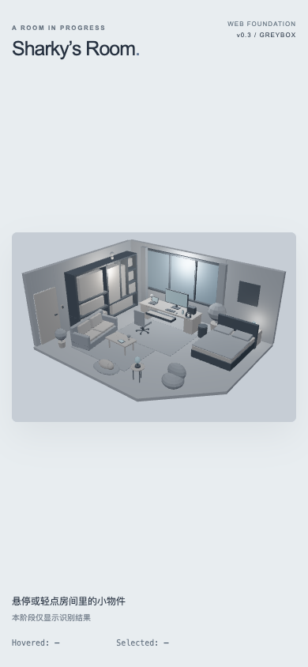

# Sharky's Room — v0.3 Web Foundation

**SHARKY'S ROOM — v0.3 WEB FOUNDATION COMPLETE**

验收日期：2026-09-17。范围：本地 Web Foundation；已停在 v0.3。

## 1. 结果与依赖版本

冻结 FINAL GLB 已直接接入 Next.js 页面，使用导出的 48mm Hero Camera，完成 9 项鼠标／触屏识别、响应式适配、错误处理和开发诊断。空间资产保持原样。

| 依赖 | 实际安装版本 |
| --- | --- |
| Next.js | 16.3.5 |
| React / React DOM | 19.2.8 / 19.2.8 |
| React Three Fiber | 9.7.0 |
| Drei | 10.7.8 |
| Three.js | 0.186.0 |
| TypeScript | 5.9.3 |
| Playwright | 1.63.0 |
| 本机验证环境 | Node.js 26.0.0 / npm 11.12.1 / macOS Chrome |

依赖固定在 `package-lock.json`。React 采用 19.2.8，以满足当前 R3F 9.7.0 的 `>=19 <19.3` peer dependency。项目最低 Node.js 20.9。安装时 npm audit 返回 0 vulnerabilities。兼容依据：包的实际 peerDependencies；另参考 [R3F 官方安装说明](https://r3f.docs.pmnd.rs/getting-started/installation) 与 [Next.js 官方安装说明](https://nextjs.org/docs/app/getting-started/installation)。

## 2. 项目结构

```text
sharkys-room/
├── app/                         页面、布局、CSS、图标
├── components/room/
│   ├── RoomApp.tsx              页面状态与普通 UI
│   ├── RoomCanvas.tsx           WebGL Canvas / error boundary
│   ├── RoomScene.tsx            下载、解析、验证、基础灯光
│   ├── RoomModel.tsx            原始 GLB 场景 primitive
│   ├── HeroCamera.tsx           导出 Hero 的独立副本
│   ├── InteractionManager.tsx   raycast 事件 → semantic ID
│   ├── LoadingScreen.tsx        进度与可读错误
│   ├── DebugPanel.tsx           可折叠开发信息
│   └── DebugBridge.tsx          只读浏览器验收接口、性能采样
├── lib/room/
│   ├── interactiveObjects.ts    唯一 9 → 14 → 9 映射
│   ├── sceneConstants.ts
│   ├── frozenSceneManifest.json 原 GLB 的 85 节点快照
│   ├── diagnostics.ts           冻结结构校验
│   └── visibleHitPoints.ts      只读可见命中点诊断
├── public/models/sharkys_room_blockout_FINAL.glb
├── types/room.ts
├── scripts/verify-asset.mjs
├── tests/                       契约 / 开发浏览器 / 生产测试
├── validation/                  结果、构建日志、截图
├── README.md
└── WEB_FOUNDATION_REPORT.md
```

UI 状态与 Three.js 对象分离；未引入 Zustand、GSAP 或额外效果框架。

## 3. GLB 加载、失败处理与资源清理

浏览器 fetch `/models/sharkys_room_blockout_FINAL.glb`，通过响应流统计下载进度，交给 `GLTFLoader.parseAsync`。通过全部冻结结构验证后才设置 ready 并渲染原场景 `primitive`。下载占进度 0–90%，解析验证后 98%，Hero 就绪后 100%。

HTTP 错误显示状态码；结构错误列出具体缺失节点，例如 `TEC_MonitorBody`。错误页面保留“重新加载”按钮，不以空白场景冒充加载成功。延迟下载、404 和缺节点均有真实浏览器负向测试；缺节点只修改测试 HTTP 响应，未修改磁盘 GLB。

卸载时 abort 下载，异步解析完成后也检查取消状态；清理 geometry、去重后的 materials、cursor 和 debug 全局接口。模型没有纹理。加载与错误不会阻塞页面动画帧。

## 4. CAM_Hero_FINAL 复现

从加载场景中获取 `CAM_Hero_FINAL`，复制为渲染相机，将其 world matrix 分解到独立副本。不重定位房间、不 detach 原相机，不修改原始相机的 projection 或 transform。

| 参数 | 浏览器数值 |
| --- | --- |
| 类型 | Perspective，48mm / 36×24mm 来源 |
| Three position XYZ | (7.8917784691, 7.6094603539, 10.2940893173) |
| Quaternion XYZW | (-0.2263760472, 0.3122957418, 0.0768931605, 0.9194088849) |
| Vertical FOV | 28.0724867912° |
| Horizontal FOV | 约 41.112090° |
| 设计 aspect | 1.5，3:2 |
| near / far | 0.0500000007 / 100 |

构图与 `hero_FINAL.png` 目视核对：展示柜、工作站、沙发／茶几、床、前景豆袋相对位置和画面边界一致。没有 OrbitControls、WASD、滚轮缩放或 fly-to。生产测试还比较了拖拽／滚轮／WASD 前后的 Canvas PNG，要求像素完全相同。

## 5. 坐标系

glTF 已将 Blender Z-up 转为 Three.js Y-up，模型加载后不再整体旋转。转换关系是 `(x, y, z) Blender → (x, z, -y) Three`。

示例：Blender Hero `(7.891778, -10.294089, 7.609460)` → Three `(7.891778, 7.609460, 10.294089)`。参考 target `(-0.043089, 0.038550, 0.780006)` → `(-0.043089, 0.780006, -0.038550)`。实际朝向直接采用导出 quaternion；targets 只读 world position，不驱动镜头。

## 6. 节点与冻结验证

| 检查 | 结果 |
| --- | --- |
| required interactive nodes | 14 / 14 |
| focus target empties | 9 / 9 |
| 原始节点名称、直接 parent、局部 position/quaternion/scale | 85 / 85 保持一致 |
| glTF mesh definitions | 55 |
| GLTFLoader primitive Mesh 对象 | 72；多材质节点拆为多个 primitive 属于加载器行为 |
| triangles / materials / textures | 6,566 / 6 / 0 |
| 摄像机参数、pivot / rail 所在节点结构 | 通过冻结快照比较 |
| source GLB 与 public copy | 逐字节相同 |
| 原 FINAL blend / GLB / Hero PNG / 报告 | 4 项 SHA256 与交付清单一致 |

GLB：**411,892 bytes（0.411892 MB）**。

SHA256：`f34b3c665ba7b08e583325bef5e3c2024f45e43ebb12a6735aa3b13a97758da2`。

`verify-asset` 361 项通过；真实 GLTFLoader 契约测试 37 / 37 通过，包括缺失节点、缺 target、错误父子关系、pivot 移动、错误相机与重复节点的失败检测。没有在网页中重新模拟 piano clearance；冻结的钢琴位置、rail 结构、pivot 和原验证资产未改动。

证据：[资产校验](validation/asset_verification.json)、[契约测试](validation/scene_contract_tests.txt)、[四项冻结文件完整性](validation/frozen_source_integrity.json)。

## 7. 9 项交互映射

| Semantic ID | 源节点 | Focus target | 浏览器验证 |
| --- | --- | --- | --- |
| monitor | TEC_MonitorBody / TEC_MonitorScreen | TGT_Monitor | hover / click / touch PASS |
| macbook | TEC_MacBookBase / TEC_MacBookScreen | TGT_MacBook | hover / click / touch PASS |
| ipad | TEC_iPad | TGT_iPad | hover / click / touch PASS |
| marshall | TEC_Marshall | TGT_Marshall | hover / click / touch PASS |
| piano | INT_PianoRail / INT_Piano | TGT_Piano | hover / click / touch PASS |
| trashcan | INT_TrashCanBody / INT_TrashCanLid | TGT_TrashCan | hover / click / touch PASS |
| lightswitch | INT_LightSwitch | TGT_LightSwitch | hover / click / touch PASS |
| phone | TEC_Phone | TGT_Phone | hover / click / touch PASS |
| window | ENV_WindowFrame / ENV_WindowGlass | TGT_Window | hover / click / touch PASS |

R3F raycast 事件从实际 Mesh 向父节点查找集中配置；最近表面停止传播，非交互表面不穿透误选后方物件。悬停设置 pointer，点击／轻点只更新 React `selected`，页脚显示 hovered / selected。未增加隐形点击代理或移动任何 pivot。桌面非交互物体的 negative case 也通过。

测试通过开发只读 API 找可见真实表面的命中点，然后用 Playwright 原生 mouse / touchscreen 操作；没有直接写 selected state。触屏测试使用整数 CSS 坐标并再次 raycast，避免点击细边时的像素取整误差。

## 8. 响应式策略

Canvas 始终按 3:2 contain 放进可用区域。固定 position / quaternion / vertical FOV，完整保留冻结房间；窄屏增加上下留白。CSS 子像素取整在 768px 时让渲染副本 aspect 约为 1.500034，视觉偏差低于 0.003%；原 GLB 相机仍保持 1.5。

| Viewport | 实测 Canvas CSS 尺寸 | 结果 |
| --- | --- | --- |
| 1920×1080 | 约 1356.61×904.41 | PASS |
| 1440×900 | 约 1086.61×724.41 | PASS |
| 1280×720 | 约 816.61×544.41 | PASS |
| 768×1024 | 688×458.66 | PASS |
| 390×844 | 360×240 | PASS |

使用 `100dvh`，Canvas `touch-action:none`，所有尺寸无横向溢出。DPR 上限 1.5。手机的小物件仍小，本阶段未新增热区或重排房间。

## 9. 桌面／移动验收

开发浏览器验收 **34 PASS / 0 FAIL**：

- 全部 9 项真实鼠标 hover + click，返回正确 semantic ID，并检查 pointer cursor。
- 390px 触屏模拟器中全部 9 项真实 tap 返回正确 ID。
- 五种尺寸连续 resize、Canvas 可见与 buffer 有效、无横向溢出。
- 默认模式没有开发 API；延迟加载页面仍响应；GLB 404 和缺 required node 提示明确。
- 正常桌面／手机／延迟恢复流程 0 console error、0 pageerror、0 缺失资产、0 React update/render warning。

测试使用本机安装的 Google Chrome + Playwright headless + ANGLE SwiftShader，移动为浏览器触屏仿真；未声称已在真实 iOS Safari、Android 硬件或所有浏览器上测试。

证据：[浏览器详细结果](validation/browser_validation.json)、[测试清单](validation/BROWSER_VALIDATION.md)。

### Desktop 1440×900



### Mobile 390×844



## 10. 性能观察与开发模式

普通模式 `frameloop="demand"`，无持续 React frame state 更新。只有开发环境且 URL 带 `?debug=1` 才挂载诊断，用持续渲染采样 FPS，每秒至多一次更新面板；不逐帧分配 React 状态。诊断接口只读。

一次桌面软件 WebGL 样本：**52.14 FPS / 19.18 ms、72 draw calls、6,566 rendered triangles**。测试中的截图、并行页面和 resize 会降低采样值；该数值用于证明诊断可用，不作为硬件性能或移动帧率承诺。未使用 post-processing、阴影贴图或最终纹理。

## 11. 安装、构建与生产验收

- `npm install`：成功；0 vulnerabilities。
- `npm run dev`：成功，127.0.0.1:3000。
- `npm run typecheck`：通过。
- `npm test`：37 / 37。
- `npm run verify:asset`：361 项通过。
- `npm run build`：成功，首页静态预渲染。
- `npm start -- --port 3001`：成功，本地 production server。

生产专项验证 **5 PASS / 0 FAIL**，与开发环境合计 **39 PASS / 0 FAIL**。结果见 [production_smoke.json](validation/production_smoke.json)；构建日志见 [production_build.txt](validation/production_build.txt)。生产模式检查首页／手机加载、GLB 200、debug 参数仍不暴露 API、固定相机和无运行错误。

## 12. 相比 Blender 预览的视觉差异

Web 保留导出灯光的空间位置／颜色，仅将运行时强度统一除以 683，并加一盏强度 1.6 的半球基础补光。GLB 文件本身保持原字节。Three 使用 AgX tone mapping；背景为中性灰蓝。

Blender World、渲染器的 AO、接触阴影、软阴影和面积灯效果不会与 Web 完全一致。浏览器画面更平、接触面缺少 Blender 的暗部，窗和展示格可能更亮。这里只保证灰盒形体可读和相机构图，未制作 final lighting、HDRI、烘焙、暖夜景或材质。

## 13. 已知限制与待 review

1. `THREE.Clock` 在当前 Three 中弃用，R3F 内部每次 Canvas mount 会输出一次 warning；不影响运行，未改依赖源码或屏蔽日志。没有重复 React warning 或错误循环。
2. SwiftShader 截图时可能提示 `GPU stall due to ReadPixels`，属于测试截图读回；不代表页面执行失败。
3. 手机 contain 留白较大，Phone / Light Switch 等几何命中面积小。9 项精确触屏事件已验证，真实手指体验和移动专用选择方案仍需后续设计。
4. 尚未验证真实手机、Safari / Firefox 与长时间硬件性能。
5. 请求用户 review 当前网页 Hero 构图、基础灯光可读性及窄屏 contain 策略。无已知阻断 v0.3 的空间／节点／构建问题。

未实现镜头动画、MacBook hinge 动画、piano sliding、trash lid 动画、灯光切换、音乐、Weather、作品集内容、React Bits 或 Unicorn Studio。没有修改冻结源资产。

## 14. 精确启动命令与停止点

```bash
cd "/Users/shaoqitang/Documents/ChatGPT/网页小屋/sharkys-room"
npm install
npm run dev
```

打开 [本地页面](http://127.0.0.1:3000)。悬停／轻点物件后查看右下／底部 `Hovered` 和 `Selected`；此时只证明识别成功。

开发诊断：[?debug=1](http://127.0.0.1:3000/?debug=1)。展开 DEV 查看映射、targets 和性能。生产启动：`npm run build` 后 `npm start -- --port 3001`。

**已停止在 v0.3 Web Foundation。等待用户 review 和下一份任务规格，不自动进入 v0.4 Interaction Prototype。**
